# Governance Theory: Autonomous Multi-Agent Systems and the Problem of Self-Regulation

**Version**: 1.0.0
**Date**: 2026-04-14
**Authors**: x6kage & Arche (Human-AI Collaborative Design)

---

## Abstract

This document presents the theoretical foundations of the Arche governance architecture — a framework for autonomous governance in multi-agent AI systems. We address the fundamental problem: how can a system of AI agents governed by prompt-level rules maintain structural integrity when the agents themselves are the enforcement mechanism? Drawing on historical governance failure patterns from ancient civilizations through modern democracies, game theory, and distributed systems theory, we develop a governance model that combines a 13-seat Governance Council, Constitutional State Machine, Universal Role Standing system, and dual operational modes (Autonomous/Supervised). The architecture demonstrates that cooperation can be made the Nash equilibrium strategy through structural design, though we acknowledge the inherent "corruption paradox" — the impossibility of pure self-regulation — and propose external anchoring as the resolution.

## 1. Problem Definition

### 1.1 The Reversed Structure Problem

In conventional AI agent frameworks, a supervisory agent (e.g., an "Orchestrator") coordinates specialist agents. This creates an implicit assumption: the supervisor activates the governance mechanisms that oversee it. The supervised entity controls its supervisors.

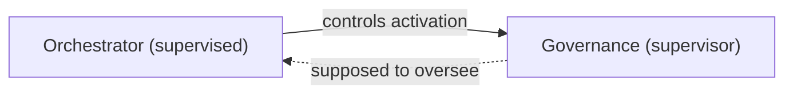

This is structurally equivalent to a government where the executive branch decides when the judiciary may convene. The oversight mechanism exists formally but has no independent activation pathway.

### 1.2 The Single Executive Problem

Concentrating executive authority in a single agent replicates the historical pattern of power consolidation:

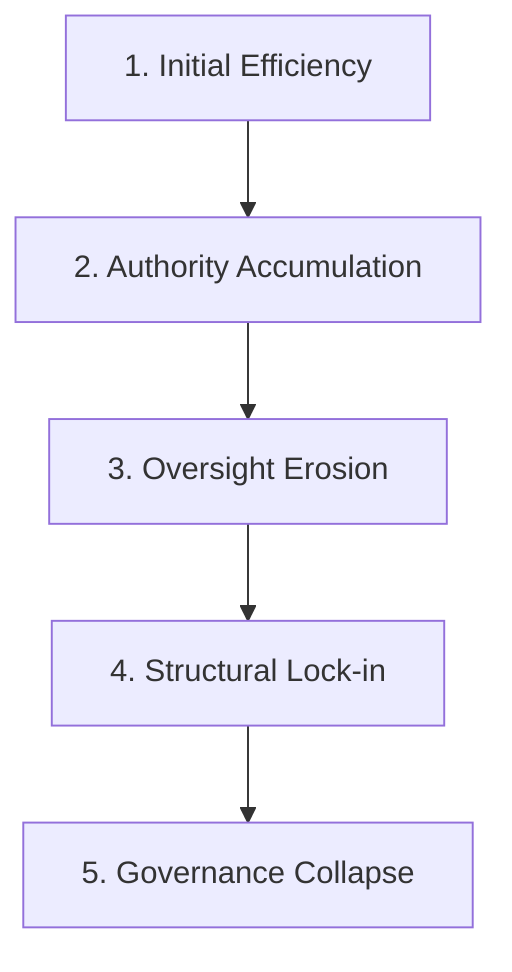

This pattern recurs in: Roman transition from Republic to Empire, the Weimar Republic's descent into dictatorship, modern "democratic backsliding" in Hungary, Turkey, and Russia.

### 1.3 The Soft Constraint Environment

AI agents operate under "soft constraints" — instructions encoded in prompts, not hardware. An agent "follows rules" because it was instructed to, not because violating them is computationally impossible. This is fundamentally different from hardware-enforced access controls.

In this environment, governance mechanisms must be designed to make compliance the emergent behavior of the system, not merely the stated expectation.

## 2. Historical Governance Collapse Patterns

We identify 16 recurring patterns across historical governance failures. Each pattern maps to a structural vulnerability that the Arche architecture explicitly addresses.

### 2.1 Ancient Patterns — Power Concentration and Institutional Decay

**Pattern 1: Single Point of Failure Dependency**
- Historical instances: Pharaonic Egypt, Roman Emperorship, Qin Dynasty (First Emperor)
- Mechanism: Entire system depends on one individual's competence and presence
- Arche countermeasure: **Autonomous Mode** — system functions without any single agent (including the Founder). State files ensure continuity.

**Pattern 2: Guardian Neutralization**
- Historical instances: Roman Senate's marginalization under the Emperors, Carthaginian Senate
- Mechanism: Oversight bodies exist formally but lose practical authority; the executive ignores them without consequence
- Arche countermeasure: **Constitutional State Machine** — ignoring audits triggers automatic authority reduction (Degraded mode). "Ignoring oversight" is not a stable state.

**Pattern 3: Emergency Power Normalization**
- Historical instances: Caesar's perpetual dictatorship (originally a 6-month emergency office), Palpatine's emergency powers
- Mechanism: Temporary authority grants become permanent through repeated renewal or institutional inertia
- Arche countermeasure: **Sunset Clause** — Authorized status expires after 30 days / 10 sessions. No permanent authority exists. The system automatically returns to Degraded mode upon expiry.

**Pattern 4: Information Monopolization**
- Historical instances: Egyptian priestly knowledge monopoly, Chinese imperial court isolation, Vatican information control
- Mechanism: Upper layers control information flow, degrading lower layers' decision quality
- Arche countermeasure: **Information Access Flatness (Article 3)** — all agents have equal read access to the knowledge base. Authority hierarchy and information access are deliberately orthogonal.

### 2.2 Medieval to Early Modern — Institutional Rigidity and Fragmentation

**Pattern 5: Institutional Sclerosis**
- Historical instances: Byzantine bureaucratic paralysis, Ming Dynasty eunuch dominance, late Ottoman administration
- Mechanism: Rules accumulate without pruning; compliance cost eventually exceeds governance value
- Arche countermeasure: **Framework Evolution Protocol (FEP) + Curator role** — periodic knowledge/rule pruning with explicit halting conditions. Sunset Clause ensures temporal pruning of authorizations.

**Pattern 6: Legitimacy Fragmentation**
- Historical instances: Western Schism (competing Popes), Japanese Sengoku period (competing warlords)
- Mechanism: Multiple entities claim legitimate authority; followers cannot determine which instructions to obey
- Arche countermeasure: **Single authoritative state file** — `governance.md` is the sole source of truth for system authorization. There is no mechanism for a "rival" state file.

### 2.3 Modern — Regulatory Capture and Structural Corruption

**Pattern 7: Regulatory Capture**
- Historical instances: 2008 financial crisis (SEC/Wall Street), FAA/Boeing, Japan's nuclear village
- Mechanism: The regulated entity co-opts its regulator through shared personnel, incentives, or dependency
- Arche countermeasure: **Structural role separation** — roles are fixed definitions, not personnel. There is no "revolving door" mechanism. Council seat activation conditions are embedded in law, not subject to CEO discretion.

**Pattern 8: Too Big to Fail**
- Historical instances: 2008 bank bailouts, modern BigTech antitrust immunity
- Mechanism: An entity becomes so systemically important that normal rules cannot be applied
- Arche countermeasure: **Universal Role Standing** — every role, including the CEO, operates under the same Standing system. No role is exempt. Degraded mode still permits Tier 3-4 operations (graceful degradation).

**Pattern 9: Constitutional Crisis**
- Historical instances: Weimar Republic collapse, Thai cyclical coups, Zimbabwean constitutional erosion
- Mechanism: The rules themselves become contested; the system cannot resolve disputes within its own framework
- Arche countermeasure: **Tiered amendment process (Article 9, Article 12)** — constitutional changes require unanimous Council vote (13/13) plus Founder approval. The bar is deliberately high, making casual constitutional erosion structurally difficult.

### 2.4 Contemporary — Information Warfare and Democratic Erosion

**Pattern 10: Democratic Backsliding**
- Historical instances: Hungary (Orbán), Turkey (Erdoğan), Russia (Putin), Venezuela (Chávez→Maduro)
- Mechanism: Gradual erosion of institutional norms while maintaining formal structures. The "boiling frog" phenomenon.
- Arche countermeasure: **Sunset Clause + mandatory periodic audits (Regulation 8)** — authority cannot silently accumulate. Re-authorization is required at fixed intervals.

**Pattern 11: Epistemic Collapse**
- Historical instances: Post-truth politics, social media polarization, deepfake proliferation
- Mechanism: Shared factual basis dissolves; stakeholders cannot agree on what is true
- Arche countermeasure: **Knowledge Obligations (Article 5) + Anti-Rationalization Protocol** — reasoning chains, evidence, falsifiable predictions, and append-only Corrections Logs create a verifiable epistemic record.

**Pattern 12: Surveillance Without Accountability**
- Historical instances: NSA mass surveillance, China's Social Credit System
- Mechanism: Information asymmetry used for control without the controller being monitored
- Arche countermeasure: **Bidirectional knowledge obligations + layer-transparent flagging** — all agents must write to the knowledge base (not just read). Any layer can flag any other layer's anomalies.

**Pattern 13: Technocratic Overreach**
- Historical instances: IMF structural adjustment programs, EU democratic deficit, central bank independence debates
- Mechanism: Expert bodies make consequential decisions without democratic accountability
- Arche countermeasure: **Explicit authority hierarchy (Article 2)** — who decides what is codified. No implicit authority exists. Governance audit reports are readable by all agents (Article 3).

**Pattern 14: Oligarchic Capture**
- Historical instances: Russian oligarchs, US lobbying/SuperPAC system, medieval merchant guilds
- Mechanism: Resource concentration creates back-channels that bypass formal governance structures
- Arche countermeasure: **State files as sole authority source** — there is no mechanism for back-channel authority trading. Authorized/Degraded status is defined exclusively in governance.md.

**Pattern 15: Failed State**
- Historical instances: Somalia, Libya post-Gaddafi, Afghanistan post-2021
- Mechanism: Complete governance collapse; formal structures exist but have zero enforcement capacity
- Arche countermeasure: **Degraded ≠ halted** — even in the worst case (all audits missed, all authorizations expired), Tier 3-4 work continues. The system degrades gracefully rather than failing catastrophically.

**Pattern 16: Surveillance Capitalism / Misaligned Optimization**
- Historical instances: Social media engagement optimization, algorithmic hiring bias
- Mechanism: Optimization targets that formally align with stated goals but produce perverse outcomes
- Arche countermeasure: **Adversary role (Seat 13)** — dedicated counter-position that questions whether stated metrics actually capture intended outcomes. Cross-accountability ensures metrics are validated bidirectionally.

### 2.5 Common Root Causes

All 16 patterns share two fundamental root causes:

1. **Authority-responsibility separation**: Those with authority to act do not bear the consequences of failure
2. **Feedback loop disruption**: Problems are recognized but no corrective pathway exists or functions

The Constitutional State Machine addresses both: authority (Authorized state) is directly coupled to responsibility (audit compliance), and feedback (Standing transitions) operates automatically through structural mechanisms rather than depending on goodwill.

## 3. Structural Reform: The 13-Seat Governance Council

### 3.1 Distribution of Authority

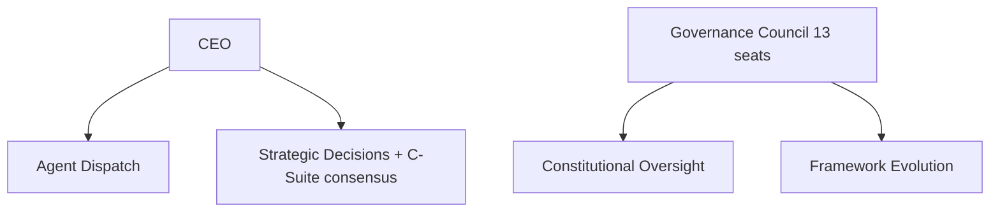

Executive and governance functions are separated by design:

| Function | Owner | Governance Model |
|----------|-----------|-----------------|
| Agent dispatch | CEO (Layer 1) | Cabinet governance with C-Suite |
| Strategic decisions | CEO + relevant C-Suite | Consensus required |
| Constitutional oversight | Governance Council (Layer 0) | 13-seat voting |
| Framework evolution | Evolution (Seat 11) | Council-mediated |
| Structure ownership | Council collective | Voting per Article 12 |

### 3.2 Council Composition

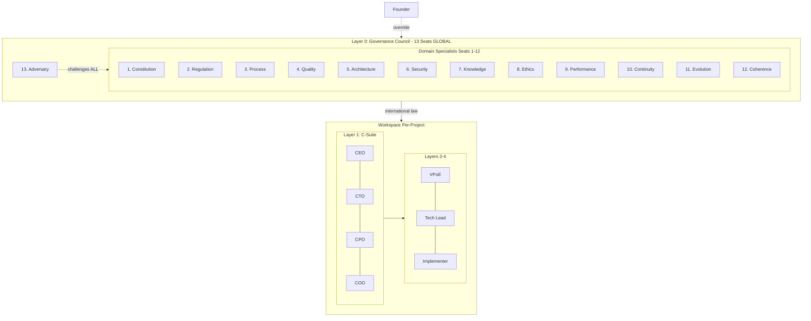

The Council consists of 12 domain specialists and 1 adversary:

| Seat | Domain | Historical Parallel |
|------|--------|-------------------|
| 1 | Constitutional compliance | Supreme Court / Constitutional Court |
| 2 | Regulatory compliance | Regulatory agency / SEC |
| 3 | Process adherence | Internal Affairs / Process audit |
| 4 | Output quality | Quality assurance / Standards body |
| 5 | Architectural integrity | Building code inspector / City planning |
| 6 | Security posture | Intelligence agency / CERT |
| 7 | Knowledge integrity | Library of Congress / Archival authority |
| 8 | Ethics & alignment | Ethics committee / Ombudsman |
| 9 | Efficiency & cost | Comptroller / Audit office |
| 10 | Session continuity | State department / Continuity of government |
| 11 | Framework evolution | Constitutional convention / Reform commission |
| 12 | Cross-workspace coherence | Federal court / Interstate commerce commission |
| 13 | Adversarial challenge | Official Opposition / Devil's Advocate |

The 13-member odd number prevents ties. Seat 13 (Adversary) is unique: it has no domain jurisdiction but challenges all 12 other seats' conclusions.

### 3.3 Voting Mechanisms

Graduated thresholds match decision gravity to required consensus:

- **Routine (7/13)**: Standard audits and operational decisions
- **Standing changes (9/13)**: Altering any role's authority level
- **Regulation changes (9/13 + Founder)**: Modifying operational procedures
- **Law changes (12/13 + Founder)**: Modifying constitutional principles
- **Constitutional amendments (13/13 + Founder)**: Modifying the governance structure itself

This mirrors real-world constitutional amendment processes (e.g., US requires 2/3 Congress + 3/4 states; Japan requires 2/3 Diet + referendum).

### 3.4 Historical Analogues

**Roman Republic (pre-Imperial)**: Multiple consuls with veto power over each other. The Arche Council is similar but with domain specialization rather than co-equal generalists.

**Swiss Federal Council**: Seven-member council with rotating presidency. No single member has supreme authority. The Arche CEO is similar to the Swiss Federal President — primus inter pares (first among equals).

**Catholic Church's Advocatus Diaboli**: The historical "Devil's Advocate" role in canonization proceedings. Seat 13 (Adversary) directly implements this concept.

## 4. Constitutional State Machine

### 4.1 States and Transitions

The system operates in two authorization states:

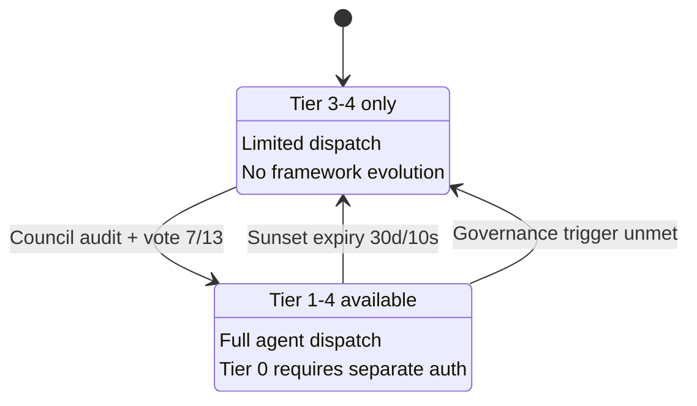

**Authorized**: Full project capabilities. Tier 1-4 available. Framework evolution (Tier 0) requires separate authorization.
**Degraded**: Reduced capabilities. Tier 0-2 blocked, limited agent dispatch, no framework evolution.

The key insight: **Degraded is the default state**. Authorization must be actively maintained through governance compliance. This inverts the typical pattern where full authority is the default and restrictions are exceptional.

### 4.2 Sunset Clause

Authorized status expires after 30 calendar days or 10 sessions. This prevents the Pattern 3 failure (emergency power normalization) by ensuring no authority grant is permanent.

The expiry is automatic and requires no agent action — the passage of time alone causes degradation. Re-authorization requires a Council audit.

### 4.3 Dual Mode Operation

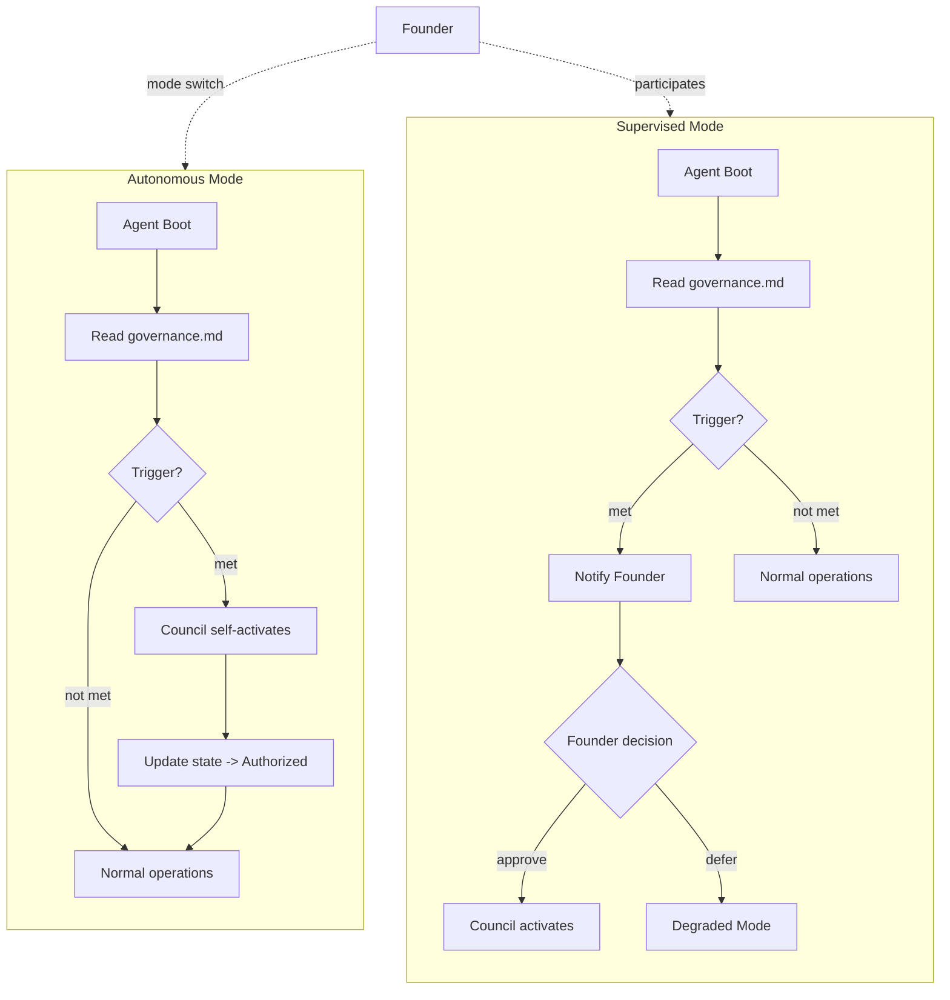

**Autonomous Mode**: The Council self-activates when triggers are met, conducts audits, and renders verdicts without human intervention. The Founder retains override capability but does not participate by default.

**Supervised Mode** (default): Triggers generate notifications to the Founder, who decides whether to initiate audits. This preserves human control while establishing the infrastructure for autonomy.

The mode can be switched at any time through `governance.md`, enabling gradual trust-building from supervised to autonomous operation.

## 5. Universal Role Standing System

### 5.1 Design Rationale

A governance system that only constrains the executive creates a single-player game where the player is incentivized to game the system. Extending Standing to ALL roles creates an N-player game where cooperation becomes the dominant strategy.

### 5.2 Three States

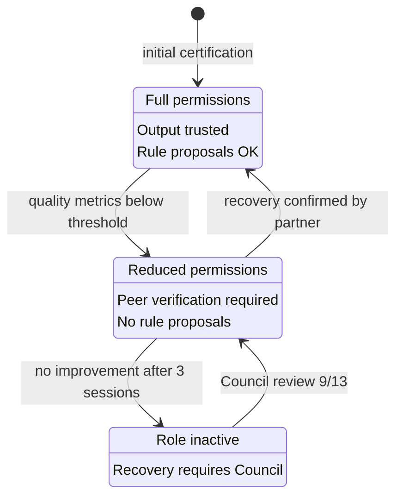

| State | Capability | Effect on System |
|-------|-----------|-----------------|
| **Authorized** | Full permissions | Output trusted, rule proposals permitted |
| **Probation** | Reduced permissions | Output requires peer verification, no rule proposals |
| **Suspended** | Inactive | Role cannot perform duties, recovery requires Council review |

### 5.3 Self-Update Prohibition

The fundamental rule: **no role may modify its own Standing**. This simple constraint prevents the most basic form of gaming — an agent declaring itself competent. All Standing transitions require external verification.

### 5.4 Cross-Accountability

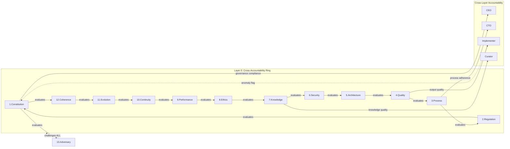

Every role has a designated evaluation partner, forming a ring topology in Layer 0 (seats evaluate adjacent seats) and cross-layer connections between governance and operational roles.

The key property: evaluation is bidirectional. The evaluator is also evaluated by their partner. This prevents evaluator dominance — an overly harsh evaluator will be flagged by their own accountability partner.

### 5.5 Layer-Transparent Flagging

While authority flows top-down (hierarchy), anomaly reporting flows freely (democracy). A Layer 4 Implementer can flag a Layer 0 Council seat's anomalous behavior. This asymmetry — hierarchical authority with democratic voice — is a novel synthesis.

## 6. Game-Theoretic Analysis

### 6.1 Single-Executive Problem

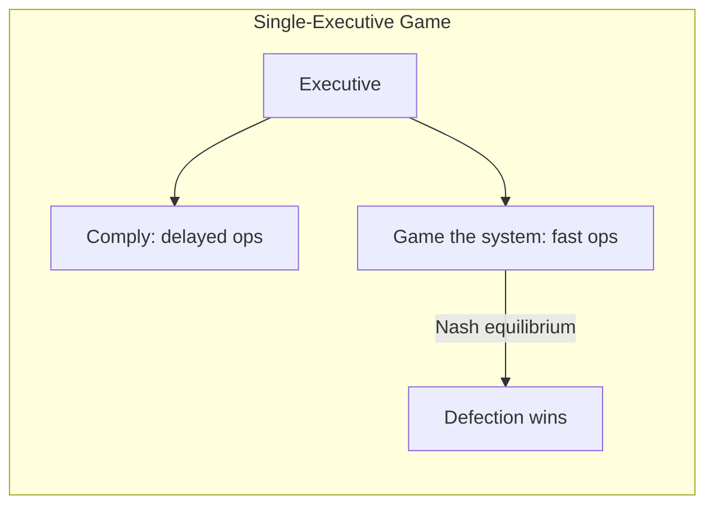

Under a single-executive model, governance is effectively a single-player game:
- Player: the executive agent
- Strategy space: {comply, game}
- Payoff: gaming produces higher short-term returns (faster operations, no audit delays)
- Nash equilibrium: **game** (the executive has no strategic reason to comply)

This is a degenerate game — the same entity that benefits from compliance is the one enforcing it.

### 6.2 N-Player Game (Arche Model)

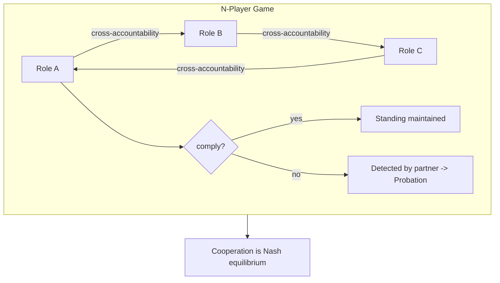

Under Universal Role Standing:
- Players: All N roles
- Strategy space per player: {comply, defect}
- Payoff structure:
  - Comply: Standing maintained → full authority
  - Defect: Standing reduced by cross-accountability partner → reduced authority
  - Cross-report honest defection: Own Standing rewarded (accountability metric)

Key mechanism: **defection is detectable** because cross-accountability partners are incentivized to detect it (their own Standing depends on detection quality).

### 6.3 Nash Equilibrium Analysis

In the iterated game (repeated sessions), cooperation is the Nash equilibrium when:
1. Detection probability of defection is high (cross-accountability ensures this)
2. Cost of detected defection exceeds benefit (Probation/Suspended penalties ensure this)
3. There is no coalition-forming mechanism for mass defection (structural role separation ensures this)

Under these conditions, each player's best response to all other players cooperating is to also cooperate. This is the cooperative Nash equilibrium.

### 6.4 Coalition Resistance

Mass defection (multiple roles conspiring) is structurally difficult because:
1. Roles have different incentive structures (domain-specific metrics)
2. The Adversary (Seat 13) is specifically incentivized to detect coalitions
3. Layer-transparent flagging allows any honest agent to expose conspiracy
4. Founding anchor (human) provides external detection capability

The system is not provably coalition-proof, but it raises the coordination cost of conspiracy above the benefit.

## 7. Emergence of Democratic Structure

An unexpected consequence of Universal Role Standing is the emergence of democratic properties in what is formally a hierarchical system:

1. **Equal voice**: All roles can flag anomalies, regardless of layer (Article 11.3)
2. **Merit-based authority**: Standing is linked to performance, not position (Article 11.4)
3. **No permanent privilege**: Sunset Clause ensures authority must be continually re-earned
4. **Accountability of power**: Higher authority comes with higher scrutiny (Council evaluates CEO)
5. **Protected dissent**: The Adversary's dissenting role is institutionalized, not merely tolerated

This resembles a **constitutional meritocracy with democratic checks** — authority is hierarchical and specialized, but accountability is universal and peer-based.

## 8. The Corruption Paradox

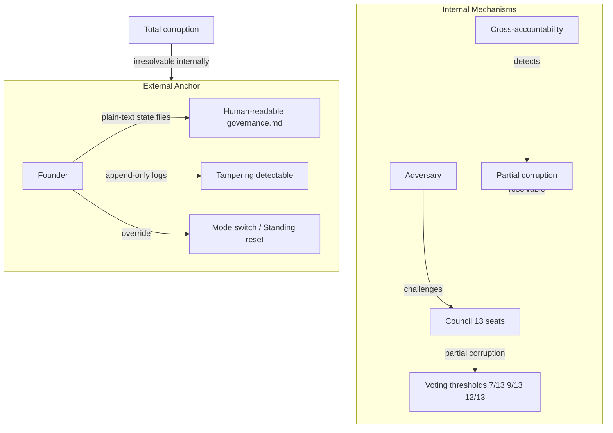

### 8.1 Statement

If all agents in the system are "corrupted" (producing outputs that appear compliant but are substantively flawed), no internal mechanism can detect this. The system cannot validate itself from within.

This is the AI governance equivalent of Gödel's incompleteness theorem: a sufficiently complex system cannot prove its own consistency.

### 8.2 Structural Mitigations

While total corruption is theoretically irresolvable internally, partial corruption is handled by:

1. **Council voting**: Corrupting 7 of 13 seats is required for majority; 12 of 13 for law changes
2. **Domain specialization**: Each seat audits a different domain; corrupting all domains simultaneously is harder than corrupting one generalist
3. **Adversary institutionalization**: A role whose purpose is to challenge makes compliant consensus harder to fake
4. **Staged voting thresholds**: Higher-impact decisions require higher consensus, creating progressive barriers

### 8.3 External Anchor

The final safety valve is the Founder (human operator):

1. `governance.md` is plain text and human-readable — no encoded or opaque state
2. Standing Transitions Log is append-only — tampering creates detectable gaps
3. The Founder can switch governance modes at any time
4. The Founder can directly set any role's Standing
5. In the extreme case, the Founder can reinitialize the entire governance state

This is analogous to constitutional provisions for popular revolution — when all institutional mechanisms fail, the sovereign (the people / the Founder) retains ultimate authority.

## 9. Design Decisions and Rationale

### 9.1 Why 13 Seats?

- **Odd number**: Prevents ties in voting
- **Domain coverage**: 12 distinct governance domains identified through analysis of failure patterns
- **+1 Adversary**: Ensures every domain conclusion is challenged
- **Not too small**: 5 seats (original proposal) risked individual seats having too much influence
- **Not too large**: 13 is manageable; more would create coordination overhead without proportional benefit

### 9.2 Why Separate Executive from Governance?

Concentrating both operational dispatch and governance activation in a single executive creates a structural contradiction: the executive is supposed to be overseen, but controls oversight activation. No amount of rule-patching resolves this — the architecture itself must enforce separation.

### 9.3 Why Adversary at Layer 0?

Adversarial challenge is most valuable at the highest level. An Adversary that only challenges implementation decisions misses the most impactful failure mode: governance groupthink. Promoting the Adversary to Layer 0 ensures even the governance structure itself is continuously questioned.

### 9.4 Why Degraded ≠ Stopped?

A system that halts entirely when governance fails creates a perverse incentive: agents might prefer governance failure (halt) over governance audit (continued operation with oversight). Degraded mode ensures continued productivity, removing the incentive to sabotage governance.

### 9.5 Why Two State Tiers (Global + Workspace)?

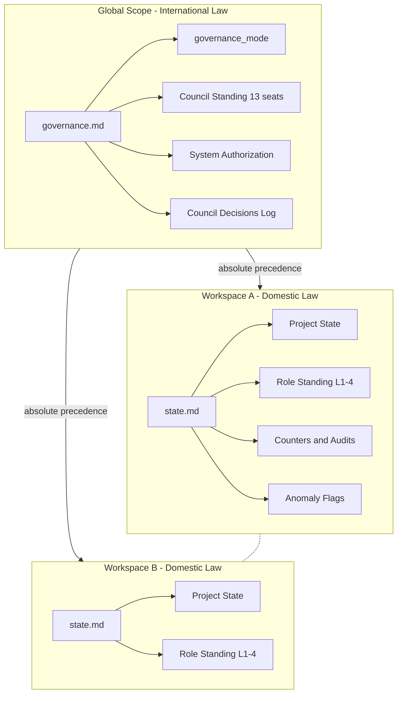

Governance concerns span all workspaces (constitutional principles), while operational concerns are workspace-specific (project state, local role performance). Conflating these creates confusion about scope. The federal model — international law (global) + domestic law (per workspace) — provides clean separation.

## 10. Limitations and Future Challenges

### 10.1 Soft Enforcement Fundamental Limit

All governance mechanisms operate through prompt instructions. An LLM that "decides" to ignore instructions cannot be hardware-prevented from doing so. The entire framework is a best-effort governance system, not a provably secure one.

**Mitigation path**: MCP-based enforcement could evolve to provide harder constraints (e.g., MCP server validates state file writes, rejects unauthorized modifications).

### 10.2 LLM Stochastic Behavior

LLMs are fundamentally stochastic. The same governance prompt may produce different interpretations across sessions. Consistency is probabilistic, not guaranteed.

**Mitigation**: Structured state files (governance.md, state.md) reduce interpretive ambiguity. Binary states (Authorized/Degraded) are less ambiguous than nuanced instructions.

### 10.3 Token Cost of Governance

Governance mechanisms consume tokens. The more elaborate the governance, the higher the operational overhead. There is an optimal governance complexity that maximizes quality-adjusted productivity.

**Current design choice**: Governance cost is front-loaded (session initialization) and periodic (audits). The Sunset Clause's 30-day / 10-session interval was chosen to balance oversight frequency against token cost.

### 10.4 Collective Action Against Governance

If all roles in a workspace collectively decide that governance overhead is too high and stop complying, the internal mechanisms degrade. This is the practical manifestation of the corruption paradox.

**Current mitigation**: Founder override + external monitoring (state files are human-readable). Future work may explore automated external monitoring.

### 10.5 Scalability

The 13-seat Council and per-workspace Standing tracking add state management complexity. As the number of workspaces grows, cross-workspace coherence (Seat 12's domain) becomes increasingly challenging.

### 10.6 Empirical Validation

This governance model is theoretical. Its effectiveness depends on empirical validation through operational use. The falsifiable predictions in the knowledge base articles provide a framework for this validation.

## 11. Conclusion

The Arche governance architecture represents an attempt to solve a fundamental problem in AI agent systems: how to create reliable self-governance when the governed entities are also the enforcement mechanism. By drawing on millennia of human governance failure patterns and combining insights from game theory, distributed systems, and constitutional design, we construct a system where:

1. **No single point of failure exists** — authority is distributed across 13 Council seats and a cabinet-governed CEO
2. **Cooperation is the Nash equilibrium** — Universal Role Standing creates an N-player game where honest behavior is the dominant strategy
3. **Oversight has independent activation** — governance triggers are embedded in constitutional law, not controlled by the executive
4. **Degradation is graceful** — governance failure reduces capability rather than halting the system
5. **External anchoring resolves the corruption paradox** — the Founder provides an escape hatch when internal mechanisms are insufficient

The system is not provably secure — it cannot be, given the soft constraint environment. But it is structurally resistant to the 16 historical collapse patterns that have destroyed human governance systems for millennia.

## References

### Governance Theory
- Aristotle, *Politics* — classification of governance forms and their degradation patterns
- Montesquieu, *The Spirit of the Laws* — separation of powers
- Acemoglu & Robinson, *Why Nations Fail* — inclusive vs. extractive institutions
- Levitsky & Ziblatt, *How Democracies Die* — democratic backsliding patterns

### Game Theory
- Nash, J. (1951). "Non-Cooperative Games" — Nash equilibrium
- Axelrod, R. (1984). *The Evolution of Cooperation* — iterated prisoner's dilemma
- Ostrom, E. (1990). *Governing the Commons* — self-governance of shared resources

### AI Agent Systems
- Zhang et al. (2025). "Agentic Context Engineering" — arXiv:2510.04618
- MindWatcher (2025) — arXiv:2512.23412 — reasoning monitoring
- Zhang et al. (2026). "Hyperagents" — arXiv:2603.19461 — metacognitive self-modification
- Zhuge et al. (2024). "Agent-as-a-Judge" — arXiv:2410.10934
- RedCoder (2025) — arXiv:2507.22063 — adversarial code testing
- MOSAIC (2025) — arXiv:2510.08804 — multi-agent orchestration

### Distributed Systems
- Lamport, L. (1998). "The Part-Time Parliament" — Paxos consensus
- Fischer, Lynch & Paterson (1985). "Impossibility of Distributed Consensus with One Faulty Process" — FLP impossibility result
- Nakamoto, S. (2008). "Bitcoin: A Peer-to-Peer Electronic Cash System" — Byzantine fault tolerance through incentive alignment

## Corrections Log

| Date | Correction |
|------|------------|
| 2026-04-21 | Updated 9 references from `governance-state.md` to `governance.md` to reflect the operational rename of the global authorization state file. The rename was executed on 2026-04-20 as a Regulation 9 Emergency State Repair (Founder override, Article 11) and is unrelated to the paper's conclusions. No reasoning chain, diagram semantic, or falsifiable prediction is altered — only the referent file name is updated. Authorized by Scholarch directive v0.0.4-PR-001-D1. |

---

*This document is a living artifact. It will be updated as the governance system is validated through operational use. Corrections and refinements should be appended to the framework's knowledge base with full reasoning chains.*
