# 統治理論: 自律型マルチエージェントシステムにおける自己規制の問題

**バージョン**: 1.0.0
**日付**: 2026-04-14
**著者**: x6kage & Arche（人間-AI 協調設計）

---

## 概要

本稿は Arche 統治アーキテクチャの理論的基盤を提示する。マルチエージェント AI システムにおける自律統治のフレームワークであり、根本的な問題に取り組む: プロンプトレベルのルールで統治される AI エージェントのシステムが、エージェント自身が執行機構である場合に、どのようにして構造的完全性を維持できるか。古代文明から現代の民主主義に至る歴史的統治崩壊パターン、ゲーム理論、分散システム理論を援用し、13席の統治評議会、Constitutional State Machine、Universal Role Standing システム、二重運用モード (自律/監督) を組み合わせた統治モデルを構築する。本アーキテクチャは構造設計を通じて協力を Nash 均衡戦略たらしめうることを示すが、同時に固有の「腐敗のパラドックス」— 純粋な自己規制の不可能性 — を認め、外部アンカーによる解決を提案する。

## 1. 問題定義

### 1.1 逆転構造の問題

従来の AI エージェントフレームワークでは、監督エージェント (例: 「Orchestrator」) が専門エージェントを調整する。これは暗黙の前提を生む: 監督者が、自身を監視する統治機構の起動を制御する。被監視者が監視者を支配する構造。

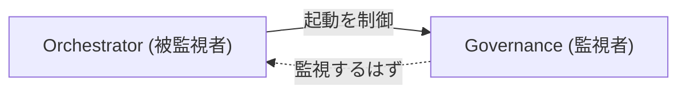

これは行政府が司法の開廷時期を決定する政府と構造的に等価である。監視機構は形式上存在するが、独立した起動経路を持たない。

### 1.2 単一行政官の問題

行政権を単一エージェントに集中させることは、権力集中の歴史的パターンを再現する:

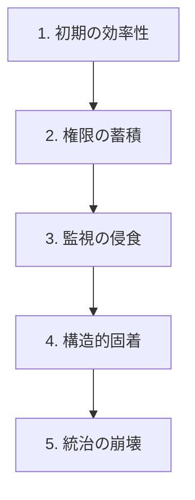

このパターンは繰り返し出現する: ローマの共和政から帝政への移行、ワイマール共和国の独裁への転落、ハンガリー・トルコ・ロシアにおける現代の「民主的後退」。

### 1.3 ソフト制約環境

AI エージェントは「ソフト制約」の下で動作する — ハードウェアではなく、プロンプトに記述された命令。エージェントが「ルールに従う」のは、違反が計算上不可能だからではなく、従うよう指示されたからである。これはハードウェアによるアクセス制御とは根本的に異なる。

この環境では、統治メカニズムはコンプライアンスをシステムの創発的動作とするよう設計されなければならない。単なる表明された期待ではなく。

## 2. 歴史的統治崩壊パターン

歴史的統治の失敗に共通する16の繰り返しパターンを特定する。各パターンは Arche アーキテクチャが明示的に対処する構造的脆弱性に対応する。

### 2.1 古代 — 権力集中と制度の衰退

**パターン 1: 単一障害点への依存**
- 歴史的事例: ファラオ制エジプト、ローマ皇帝制、秦 (始皇帝)
- メカニズム: システム全体が一個人の能力と存在に依存
- Arche 対策: **Autonomous Mode** — 単一のエージェント (Founder を含む) なしでもシステムが機能。状態ファイルが継続性を保証

**パターン 2: 監視者の無力化**
- 歴史的事例: 帝政下のローマ元老院の形骸化、カルタゴ元老院
- メカニズム: 監視機関は形式上存在するが実質的権限を失う; 行政がそれを無視しても何も起きない
- Arche 対策: **Constitutional State Machine** — 監査を無視すること自体が権限縮小 (Degraded) を引き起こす。「無視しても何も起きない」状態が存在しない

**パターン 3: 緊急権限の常態化**
- 歴史的事例: カエサルの永続的独裁 (元は6ヶ月の緊急職)、パルパティーンの緊急権限
- メカニズム: 一時的な権限付与が反復更新や制度的惰性により恒久化
- Arche 対策: **Sunset Clause** — Authorized 状態は30日/10セッションで失効。恒久的権限は存在しない。失効時、システムは自動的に Degraded に回帰

**パターン 4: 情報の独占**
- 歴史的事例: エジプト神官の知識独占、中国宮廷の情報隔離、バチカンの情報統制
- メカニズム: 上位層が情報の流れを支配し、下位層の判断精度が劣化
- Arche 対策: **Information Access Flatness (Article 3)** — 全エージェントが知識ベースへの平等な読み取り権を持つ。権限の階層と情報アクセスは意図的に直交

### 2.2 中世〜近世 — 制度の硬直化と分裂

**パターン 5: 制度の硬化症**
- 歴史的事例: ビザンツの官僚制麻痺、明朝の宦官支配、末期オスマン帝国
- メカニズム: ルールが刈り込みなく蓄積; 遵守コストが統治の価値を超える
- Arche 対策: **Framework Evolution Protocol (FEP) + Curator** — 明示的な停止条件付きの定期的な知識/ルール刈り込み。Sunset Clause が認可の時間的刈り込みを保証

**パターン 6: 正統性の分裂**
- 歴史的事例: 教会大分裂 (複数の教皇)、日本の戦国時代
- メカニズム: 複数の実体が正統な権威を主張; 従者がどの指示に従うべきか判断不能に
- Arche 対策: **単一の権威的状態ファイル** — `governance.md` がシステム認可の唯一の真実の源泉。「対立する」状態ファイルのメカニズムが存在しない

### 2.3 近代 — 規制の回避と構造的腐敗

**パターン 7: 規制の虜 (Regulatory Capture)**
- 歴史的事例: 2008年金融危機 (SEC/ウォール街)、FAA/ボーイング、日本の原子力村
- メカニズム: 被規制者が共有人事・インセンティブ・依存を通じて規制者を取り込む
- Arche 対策: **構造的ロール分離** — ロールは人員ではなく固定定義。「回転ドア」メカニズムが存在しない。評議会席の起動条件は法に埋め込まれ、CEO の裁量に服さない

**パターン 8: Too Big to Fail**
- 歴史的事例: 2008年銀行救済、現代の BigTech 独禁法免疫
- メカニズム: ある実体がシステム上重要になりすぎて通常のルールを適用できなくなる
- Arche 対策: **Universal Role Standing** — CEO を含む全ロールが同じ Standing システムの下で動作。免除されるロールはない。Degraded でも Tier 3-4 は動作 (graceful degradation)

**パターン 9: 憲法危機**
- 歴史的事例: ワイマール共和国の崩壊、タイの繰り返すクーデター、ジンバブエの憲法侵食
- メカニズム: ルール自体が争点となり、自らのフレームワーク内で紛争を解決できない
- Arche 対策: **段階的改正プロセス (Article 9, 12)** — 憲法改正には評議会全会一致 (13/13) + Founder 承認が必要。ハードルを意図的に高くし、安易な憲法侵食を構造的に困難に

### 2.4 現代 — 情報戦争と民主的侵食

**パターン 10: 民主的後退 (Democratic Backsliding)**
- 歴史的事例: ハンガリー (オルバーン)、トルコ (エルドアン)、ロシア (プーチン)、ベネズエラ (チャベス→マドゥロ)
- メカニズム: 形式的構造を維持しつつ制度的規範を漸進的に侵食。「茹でガエル」現象
- Arche 対策: **Sunset Clause + 定期監査の義務化 (Regulation 8)** — 権限は暗黙に蓄積できない。一定間隔での再認可が必須

**パターン 11: 認識論的崩壊 (Epistemic Collapse)**
- 歴史的事例: ポスト真実政治、SNS による分極化、ディープフェイクの拡散
- メカニズム: 共有された事実基盤が溶解; 利害関係者が何が真実かについて合意不能に
- Arche 対策: **Knowledge Obligations (Article 5) + Anti-Rationalization Protocol** — 推論の連鎖、証拠、反証可能な予測、追記のみの Corrections Log が検証可能な認識論的記録を構成

**パターン 12: 説明責任なき監視**
- 歴史的事例: NSA 大量監視、中国の社会信用システム
- メカニズム: 情報の非対称性を統制に利用するが、統制者自身は監視されない
- Arche 対策: **双方向の知識義務 + Layer 透過的フラグ** — 全エージェントは知識ベースへの書き込みが義務 (読み取りだけでなく)。いかなる層も他のいかなる層の異常をフラグ可能

**パターン 13: テクノクラートの暴走**
- 歴史的事例: IMF の構造調整プログラム、EU の民主主義の赤字、中央銀行の独立性問題
- メカニズム: 専門家集団が民主的説明責任なく重大な意思決定を行う
- Arche 対策: **明示的な Authority Hierarchy (Article 2)** — 誰が何を決定する権限を持つかが明文化。暗黙の権力が存在しない。統治監査報告は全エージェントが読める (Article 3)

**パターン 14: 寡頭制による取り込み (Oligarchic Capture)**
- 歴史的事例: ロシアのオリガルヒ、米国のロビイスト/スーパーPAC、中世の商人ギルド
- メカニズム: 資源の集中が形式的統治構造を迂回する裏チャネルを形成
- Arche 対策: **状態ファイルが唯一の権限源泉** — 裏チャネルでの権限「取引」メカニズムが存在しない。Authorized/Degraded は governance.md でのみ定義

**パターン 15: 破綻国家 (Failed State)**
- 歴史的事例: ソマリア、カダフィ後のリビア、2021年以降のアフガニスタン
- メカニズム: 統治の完全な崩壊; 形式的構造は存在するが執行能力がゼロ
- Arche 対策: **Degraded ≠ 停止** — 最悪のケース (全監査未実施、全認可失効) でも Tier 3-4 の作業は継続。システムは壊滅的に失敗するのではなく、優雅に劣化する

**パターン 16: 監視資本主義 / 整合性のない最適化**
- 歴史的事例: SNS のエンゲージメント最適化、アルゴリズム採用バイアス
- メカニズム: 表明された目標と形式的に整合する最適化対象が歪んだ結果を生む
- Arche 対策: **Adversary (席13)** — 表明された指標が意図された結果を実際に捕捉しているかを問う専門の対抗ポジション。Cross-accountability が指標の双方向的検証を保証

### 2.5 共通する根本原因

全16パターンは二つの根本原因を共有する:

1. **権限と責任の分離** — 行動する権限を持つ者が失敗のコストを負わない
2. **フィードバックループの断絶** — 問題は認知されるが是正に至るパスが存在しないか機能しない

Constitutional State Machine は両方を構造的に解決する: 権限 (Authorized) は責任 (監査遵守) と直接結合し、フィードバック (Standing 遷移) は善意に依存せず構造的メカニズムを通じて自動的に作用する。

## 3. 構造改革: 13席統治評議会

### 3.1 権限の分散

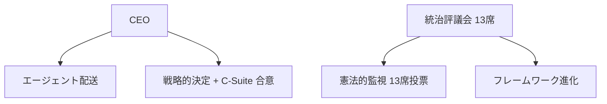

行政と統治の機能は設計上分離される:

| 機能 | 所有者 | 統治モデル |
|------|------------|----------|
| エージェント配送 | CEO (Layer 1) | C-Suite との閣議制 |
| 戦略的決定 | CEO + 関連 C-Suite | 合意が必要 |
| 憲法的監視 | 統治評議会 (Layer 0) | 13席投票 |
| フレームワーク進化 | Evolution (席11) | 評議会媒介 |
| 構造の所有権 | 評議会の集合的決定 | Article 12 に基づく投票 |

### 3.2 評議会の構成

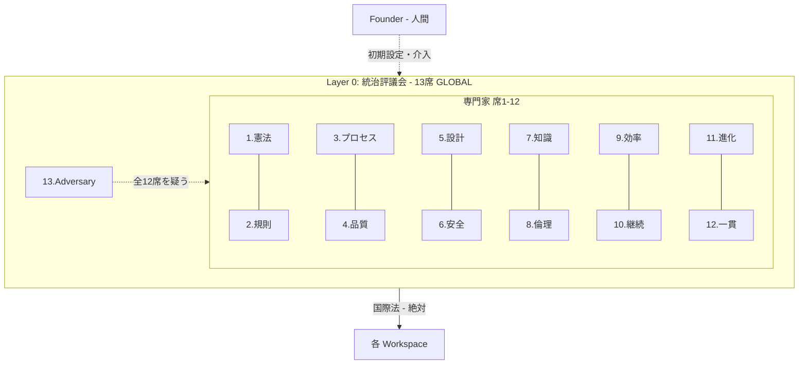

12人の専門家と1人の Adversary で構成。奇数13人で同数を回避。席13 (Adversary) はドメイン管轄を持たず、他の全12席の結論に挑戦する。

### 3.3 投票メカニズム

段階的閾値が決定の重大さに応じた合意を要求:

| 決定の種類 | 閾値 | 説明 |
|-----------|------|------|
| 通常監査 | 過半数 (7/13) | 標準的な監査と運用決定 |
| Standing 変更 | 特別多数 (9/13) | ロールの権限レベルの変更 |
| 規則改正 | 特別多数 (9/13) + Founder | regulation.md の変更 |
| 法改正 | 準全会一致 (12/13) + Founder | law.md の変更 |
| 憲法改正 | 全会一致 (13/13) + Founder | 統治構造自体の変更 |

### 3.4 歴史的類似

**ローマ共和政**: 相互拒否権を持つ複数の執政官。Arche の評議会は類似するが、対等な汎用者ではなくドメインの専門化を採用。

**スイス連邦参事会**: 輪番制議長を持つ7人の参事会。単一のメンバーが最高権限を持たない。Arche の CEO はスイスの連邦大統領に類似 — primus inter pares (同輩中の首席)。

**カトリック教会の Advocatus Diaboli**: 列聖審査における歴史的な「悪魔の代弁者」の役割。席13 (Adversary) はこの概念を直接実装。

## 4. Constitutional State Machine

### 4.1 状態と遷移

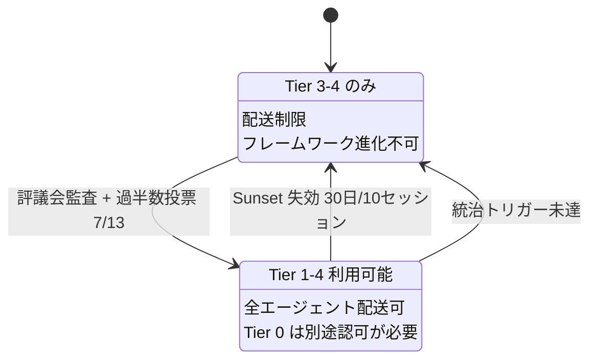

重要な洞察: **Degraded がデフォルト状態である**。認可は統治遵守を通じて能動的に維持されなければならない。これは全権限がデフォルトで制限が例外的である典型的パターンを反転させる。

### 4.2 Sunset Clause

Authorized 状態は30暦日または10セッションで失効する。これはパターン3の失敗 (緊急権限の常態化) を、いかなる権限付与も恒久的でないことを保証することで防止する。

失効は自動的であり、エージェントの行動を必要としない — 時間の経過のみが劣化を引き起こす。再認可には評議会の監査が必要。

### 4.3 二重モード運用

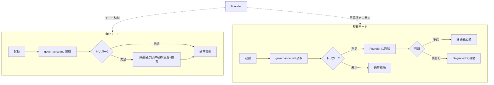

## 5. Universal Role Standing システム

### 5.1 設計根拠

行政官のみを制約する統治システムは、プレイヤーがシステムをゲームするインセンティブを持つ単一プレイヤーゲームを生む。Standing を全ロールに拡張することで、協力が支配戦略となる N 人ゲームが生まれる。

### 5.2 三つの状態

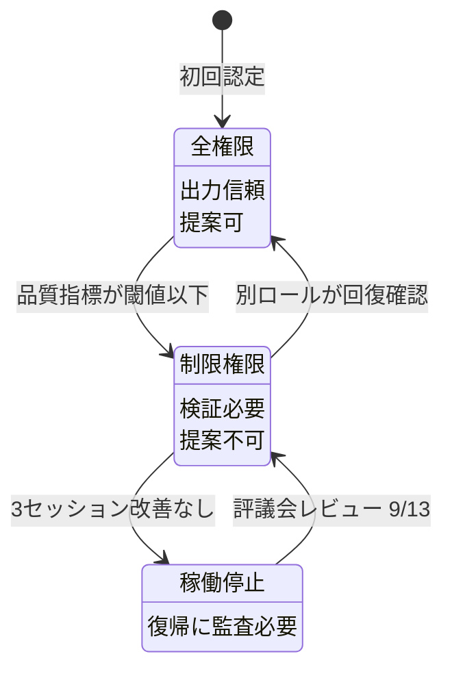

### 5.3 自己更新禁止

根本規則: **いかなるロールも自身の Standing を変更できない**。この単純な制約が最も基本的な形態のゲーミング — エージェントが自身を有能と宣言すること — を防止する。全ての Standing 遷移に外部検証が必要。

### 5.4 Cross-Accountability (相互説明責任)

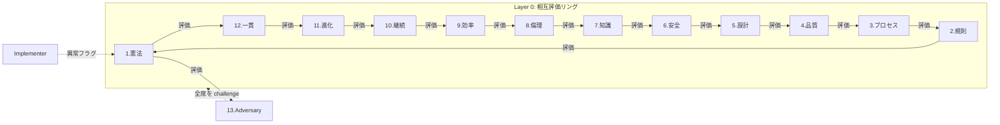

全ロールが指定された評価パートナーを持ち、Layer 0 ではリングトポロジー (席が隣接する席を評価) を形成。Layer 間では統治と運用ロール間のクロスレイヤー接続。

### 5.5 Layer 透過的フラグ

権限がトップダウンに流れる (階層) 一方、異常報告は自由に流れる (民主主義)。Layer 4 の Implementer が Layer 0 の評議会席の異常な行動をフラグできる。この非対称性 — 階層的権限と民主的発言権 — は新しい統合である。

## 6. ゲーム理論的分析

### 6.1 単一行政官問題

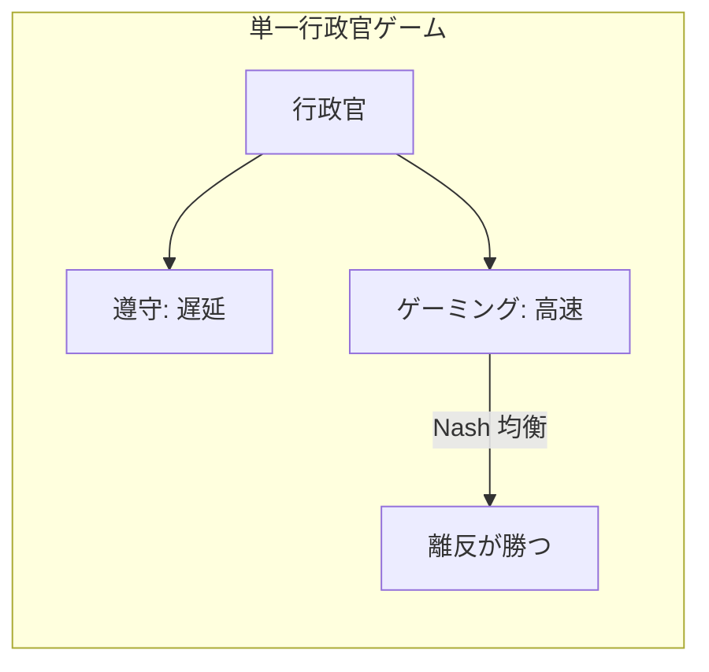

### 6.2 N 人ゲーム (Arche モデル)

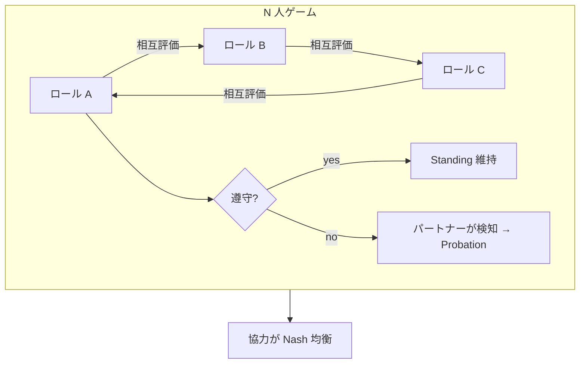

### 6.3 Nash 均衡分析

反復ゲーム (繰り返しセッション) において、協力は以下の条件で Nash 均衡となる:
1. 離反の検知確率が高い (cross-accountability がこれを保証)
2. 検知された離反のコストが利益を超える (Probation/Suspended ペナルティがこれを保証)
3. 大量離反のための連合形成メカニズムがない (構造的ロール分離がこれを保証)

### 6.4 連合耐性

大量離反 (複数ロールの共謀) が構造的に困難である理由:
1. ロールは異なるインセンティブ構造を持つ (ドメイン固有の指標)
2. Adversary (席13) は連合の検知に特化してインセンティブされている
3. Layer 透過的フラグにより正直なエージェントが共謀を暴露可能
4. Founder (人間) が外部からの検知能力を提供

## 7. 民主主義的構造の創発

Universal Role Standing の予期しない帰結として、形式的には階層制のシステムに民主主義的性質が創発する:

1. **対等な発言権**: 全ロールが Layer に関係なく異常をフラグ可能 (Article 11.3)
2. **実力主義的権限**: Standing は地位ではなくパフォーマンスに連動 (Article 11.4)
3. **恒久的特権の不在**: Sunset Clause により権限は継続的に再獲得が必要
4. **権力の説明責任**: より高い権限にはより高い監視が伴う (評議会が CEO を評価)
5. **保護された異議**: Adversary の異議の役割が単に許容されるだけでなく制度化

これは **民主的チェックを備えた立憲的メリトクラシー** に類似 — 権限は階層的かつ専門的だが、説明責任は普遍的かつピアベース。

## 8. 腐敗のパラドックス

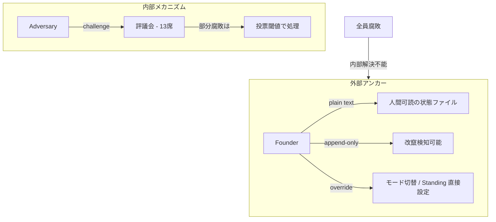

### 8.1 命題

システム内の全エージェントが「腐敗」している場合 (遵守しているように見えるが実質的に欠陥のある出力を生産)、いかなる内部メカニズムもこれを検知できない。システムは自身を内部から検証できない。

これは AI 統治における Gödel の不完全性定理の等価物: 十分に複雑なシステムは自身の無矛盾性を証明できない。

### 8.2 構造的緩和

全面的腐敗は理論上内部で解決不能だが、部分的腐敗は以下で処理される:
1. **評議会投票**: 過半数には13席中7席の腐敗が必要; 法改正には12席
2. **ドメイン専門化**: 各席が異なるドメインを監査; 全ドメインの同時腐敗は一人の汎用者よりも困難
3. **Adversary の制度化**: 挑戦することが目的のロールの存在が、遵守的合意の偽装を困難に
4. **段階的投票閾値**: より影響の大きい決定にはより高い合意を要求し、漸進的障壁を構成

### 8.3 外部アンカー

最終的な安全弁は Founder (人間の操作者):
1. `governance.md` は plain text で人間可読 — エンコードされたり不透明な状態ではない
2. Standing Transitions Log は追記のみ — 改竄は検知可能なギャップを生む
3. Founder はいつでも統治モードを切り替えられる
4. Founder はいかなるロールの Standing も直接設定可能
5. 極端な場合、Founder は統治状態全体を再初期化可能

これは革命のための憲法規定に類似 — 全ての制度的メカニズムが失敗した場合、主権者 (人民 / Founder) が最終的権限を保持する。

## 9. 設計判断と根拠

### 9.1 なぜ13席か?
- **奇数**: 投票の同数を防止
- **ドメイン網羅**: 崩壊パターンの分析から12の独立した統治ドメインを特定
- **+1 Adversary**: 全てのドメインの結論が挑戦されることを保証
- **少なすぎない**: 5席 (初期提案) は個々の席の影響力が大きすぎるリスク
- **多すぎない**: 13は管理可能; それ以上は比例的利益なく調整オーバーヘッドを増大

### 9.2 なぜ行政と統治を分離するか?
行政の配送と統治の起動を単一の行政官に集中させることは構造的矛盾を生む: 行政は監視されるべきだが、監視の起動を制御している。いかなるルール修正もこの矛盾を解決しない — アーキテクチャ自体が分離を強制しなければならない。

### 9.3 なぜ Adversary を Layer 0 に?
敵対的挑戦は最高レベルで最も価値がある。実装の決定のみを挑戦する Adversary は最も影響力のある失敗モード — 統治のグループシンク — を見逃す。Adversary を Layer 0 に昇格することで、統治構造自体が継続的に問われる。

### 9.4 なぜ Degraded ≠ 停止か?
統治が失敗した時に完全に停止するシステムは歪んだインセンティブを生む: エージェントが統治の失敗 (停止) を統治監査 (監視下での続行) より好むかもしれない。Degraded モードは継続的な生産性を保証し、統治を妨害するインセンティブを除去する。

### 9.5 なぜ二層の状態ファイルか?

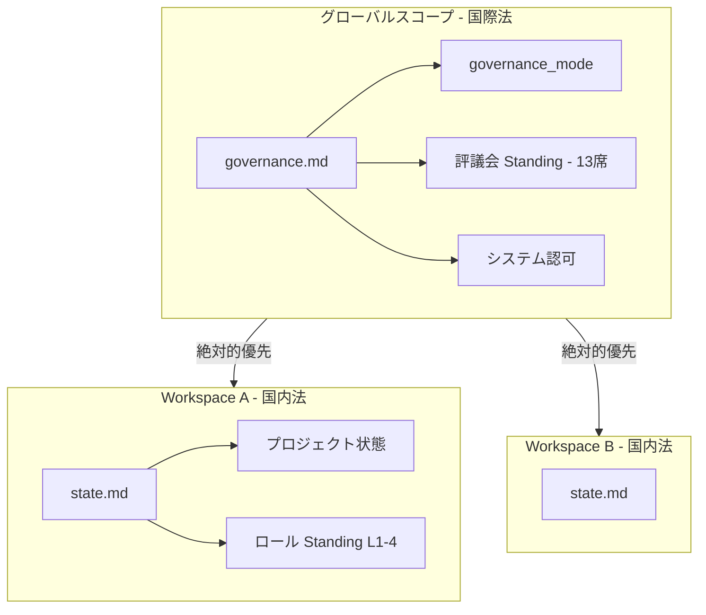

統治の関心事は全ワークスペースに跨る (憲法原則) が、運用の関心事はワークスペース固有 (プロジェクト状態、ローカルのロール性能)。これらを混同するとスコープの混乱を生む。連邦モデル — 国際法 (グローバル) + 国内法 (ワークスペースごと) — が明確な分離を提供する。

## 10. 限界と今後の課題

### 10.1 ソフト制約の根本的限界
全統治メカニズムはプロンプト命令で動作する。命令を無視することを「決定」した LLM をハードウェアで防止することはできない。フレームワーク全体がベストエフォートの統治システムであり、証明可能に安全なものではない。

**緩和パス**: MCP ベースの制約がより硬い制約を提供するよう進化可能 (例: MCP サーバーが状態ファイルへの書き込みを検証し、無認可の変更を拒否)。

### 10.2 LLM の確率的動作
LLM は根本的に確率的。同じ統治プロンプトがセッション間で異なる解釈を生みうる。一貫性は確率的であり、保証されない。

### 10.3 統治のトークンコスト
統治メカニズムはトークンを消費する。より精巧な統治はより高い運用オーバーヘッド。品質調整後の生産性を最大化する最適な統治複雑度が存在する。

### 10.4 統治に対する集団行動
ワークスペース内の全ロールが統治オーバーヘッドが過大と判断し遵守を停止した場合、内部メカニズムは劣化する。これは腐敗のパラドックスの実践的発現。

### 10.5 スケーラビリティ
13席の評議会とワークスペースごとの Standing 追跡は状態管理の複雑さを増す。ワークスペースの数が増えると、ワークスペース間の一貫性 (席12のドメイン) の課題が増大。

### 10.6 実証的検証
この統治モデルは理論的である。その有効性は運用を通じた実証的検証に依存する。知識ベースの記事中の反証可能な予測がこの検証の枠組みを提供する。

## 11. 結論

Arche 統治アーキテクチャは AI エージェントシステムにおける根本的問題の解決を試みる: 被統治者が同時に執行機構である場合に、いかにして信頼性のある自己統治を創出するか。数千年の人間の統治崩壊パターンを援用し、ゲーム理論、分散システム、憲法設計からの洞察を統合して、以下を実現するシステムを構築する:

1. **単一障害点の不在** — 権限が13の評議会席と閣議制の CEO に分散
2. **協力が Nash 均衡** — Universal Role Standing が正直な行動が支配戦略となる N 人ゲームを創出
3. **監視の独立的起動** — 統治トリガーが憲法に埋め込まれ、行政によって制御されない
4. **劣化は優雅** — 統治の失敗がシステムを停止するのではなく能力を削減
5. **外部アンカーが腐敗のパラドックスを解決** — 内部メカニズムが不十分な場合の脱出口を Founder が提供

システムは証明可能に安全ではない — ソフト制約環境ではありえない。しかし、数千年にわたり人間の統治システムを破壊してきた16の歴史的崩壊パターンに対して構造的に耐性がある。

## 参考文献

### 統治理論
- Aristotle, *Politics* — 統治形態の分類とその劣化パターン
- Montesquieu, *The Spirit of the Laws* — 権力分立
- Acemoglu & Robinson, *Why Nations Fail* — 包摂的制度 vs 収奪的制度
- Levitsky & Ziblatt, *How Democracies Die* — 民主的後退パターン

### ゲーム理論
- Nash, J. (1951). "Non-Cooperative Games" — Nash 均衡
- Axelrod, R. (1984). *The Evolution of Cooperation* — 反復囚人のジレンマ
- Ostrom, E. (1990). *Governing the Commons* — 共有資源の自己統治

### AI エージェントシステム
- Zhang et al. (2025). "Agentic Context Engineering" — arXiv:2510.04618
- MindWatcher (2025) — arXiv:2512.23412 — 推論モニタリング
- Zhang et al. (2026). "Hyperagents" — arXiv:2603.19461 — メタ認知的自己修正
- Zhuge et al. (2024). "Agent-as-a-Judge" — arXiv:2410.10934
- RedCoder (2025) — arXiv:2507.22063 — 敵対的コードテスト
- MOSAIC (2025) — arXiv:2510.08804 — マルチエージェントオーケストレーション

### 分散システム
- Lamport, L. (1998). "The Part-Time Parliament" — Paxos 合意
- Fischer, Lynch & Paterson (1985). "Impossibility of Distributed Consensus with One Faulty Process" — FLP 不可能性結果
- Nakamoto, S. (2008). "Bitcoin: A Peer-to-Peer Electronic Cash System" — インセンティブ整合を通じたビザンチン耐障害性

## 修正記録 (Corrections Log)

| 日付 | 修正内容 |
|------|---------|
| 2026-04-21 | グローバル認可状態ファイルの運用上の改名を反映するため、`governance-state.md` への 6 箇所の参照を `governance.md` に更新した。この改名は 2026-04-20 に Regulation 9 Emergency State Repair（Founder override、Article 11）として実施されたもので、本稿の結論とは無関係である。推論の連鎖、図の意味、反証可能な予測はいかなる形でも変更されていない — 参照先ファイル名のみを更新する。Scholarch directive v0.0.4-PR-001-D1 による承認。 |

---

*本稿は生きた成果物である。統治システムが運用を通じて検証されるにつれ更新される。修正と改善は完全な推論の連鎖と共にフレームワークの知識ベースに追記されるべきである。*
